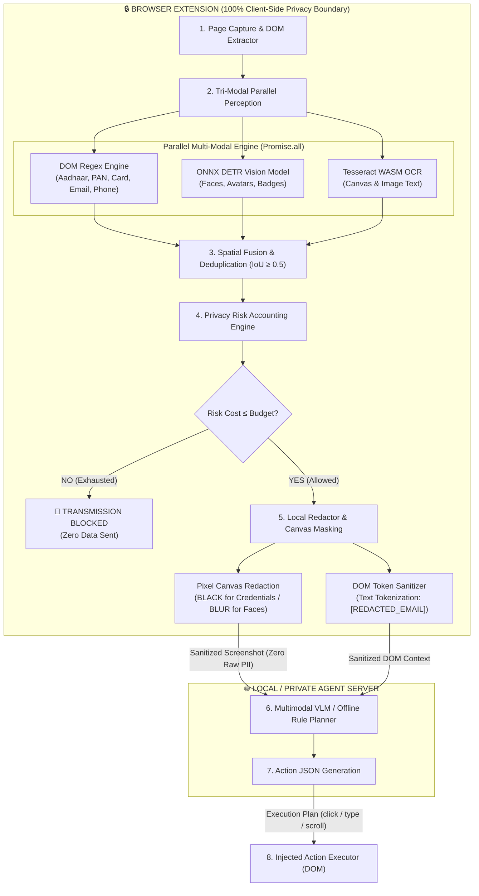

# High-Level System Architecture (PPT Presentation Guide)

> **SIH 2026 Problem Statement 26171**  
> **Project Title**: Privacy-Preserving Browser GUI Agent  
> **Slide Reference**: Architecture Overview & Technical Highlights

---

## 1. System Architecture Diagram (Slide Visual)

---

## 2. Text Layout for PPT Slides (Copy-Paste Ready)

### Slide Title: **High-Level System Architecture**

#### 🔹 Layer 1: Client-Side Perception Layer
* **Tri-Modal Parallel Engine**: Runs DOM Regex, ONNX DETR Object Detection (WebGPU/WASM), and Tesseract WASM OCR concurrently via `Promise.all()`.
* **Latency Optimization**: **45.21% latency reduction** (73 ms → 40 ms median).
* **Localized Indian PII Detection**: Built-in precision pattern matchers for **Aadhaar**, **PAN Card**, **IFSC Codes**, **Passports**, and **Indian Phone Numbers**.

#### 🔹 Layer 2: Privacy Risk & Redaction Layer
* **Privacy Risk Budget Accounting**: Assigns category-specific risk units and blocks network dispatch if cumulative step cost exceeds remaining risk budget.
* **Dual-Media Canvas Masking**: 
  * **Visual Masking**: Applies solid `BLACK` pixel overlays over credentials/passwords and gaussian `BLUR` over biometric faces/avatars.
  * **Text Tokenization**: Replaces DOM strings with safe placeholders (`[REDACTED_AADHAAR]`).
* **Zero-Trust Boundary**: **0-byte raw image leakage** and **0 unredacted PII strings** leave the extension.

#### 🔹 Layer 3: Decision & Execution Layer
* **Multimodal VLM Planner**: Accepts sanitized context + pixel-masked screenshots to generate action plans (`click`, `type`, `scroll`).
* **Offline Rule-Based Fallback**: Autonomous multi-tier scoring planner for uninterrupted execution when local VLM is offline.
* **Bounded Action Execution**: Injected DOM executor with loop-guard protection (prevents repeated action loops).

#### 🔹 Layer 4: Audit & Telemetry Layer
* **Live Tri-Color Inspector**: Visual page overlay rendering green (DOM), blue (Vision), and red (OCR) source indicators.
* **Resource Telemetry**: Real-time extension dashboard tracking JS Heap memory, WebGPU/WASM engine state, and latency metrics.

---

## 3. Key Pitch Highlights for Evaluators (PPT Speaker Notes)

1. **Strict 100% Privacy Boundary**:
   > *"No raw pixels or plaintext PII ever leave the browser. All detection and redaction happen locally before any network request is created."*

2. **Parallel Perception Engine**:
   > *"By parallelizing DETR object vision and Tesseract WASM OCR, perception latency drops by 45.2%, making privacy protection imperceptible to the user."*

3. **Engineering Risk Budgeting**:
   > *"We don't rely on simple regex masking; our agent maintains a dynamic Privacy Risk Accounting budget that automatically blocks execution if cumulative risk exposure becomes unsafe."*

4. **Dual-Mode Resilient Intelligence**:
   > *"If an offline VLM model is unavailable, our intelligent multi-tier rule planner seamlessly takes over, ensuring zero downtime during automation."*
