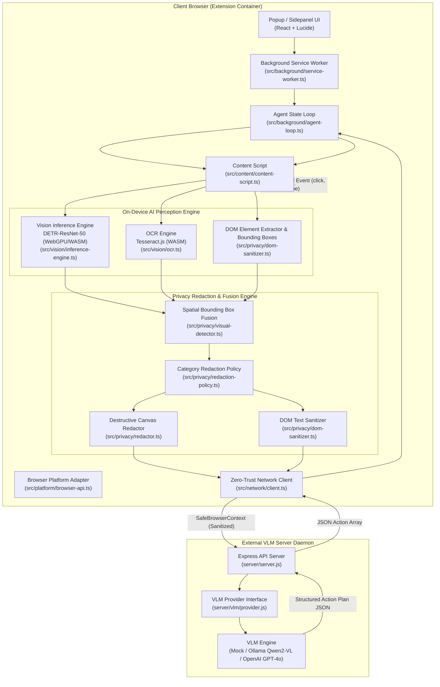
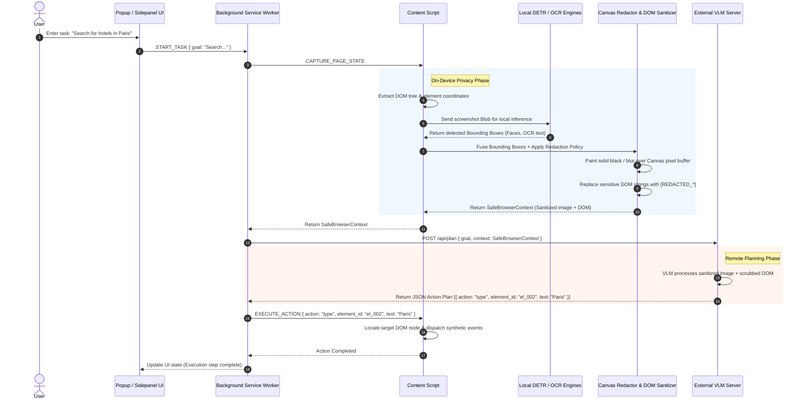

# 🛡️ High-Level Design (HLD): Privacy-Preserving Browser Agent

**Smart India Hackathon (SIH 2026) Prototype — Problem Statement 26171**  
*“On-Device Visual Perception for Light-Weight Browser Agents”*

---

## 1. Executive Summary & Architectural Goals

The **Privacy-Preserving Browser Agent** is a multi-browser web extension (Chrome & Firefox MV3) designed to enable autonomous, AI-driven browser navigation while guaranteeing **absolute data privacy**. 

Traditional vision-based web agents stream raw screenshots and DOM text directly to remote Vision-Language Models (VLMs), exposing user secrets, auth tokens, emails, financial records, and biometric visual data. This project solves that fundamental vulnerability by establishing an **On-Device Zero-Trust Privacy Boundary**. 

```
                               ┌─────────────────────────────────────────────────────────┐
                               │                    CLIENT BROWSER                       │
                               │                                                         │
  ┌──────────────┐             │  ┌─────────────────┐       ┌─────────────────────────┐  │             ┌─────────────────┐
  │ User Prompt  │────────────►│  │  Agent Loop     │──────►│ On-Device AI Perception │  │             │ Remote VLM Host │
  └──────────────┘             │  │ Service Worker  │       │ (DETR-ResNet + OCR +    │  │             │ (Ollama/OpenAI) │
                               │  └─────────────────┘       │  DOM Spatial Fusion)    │  │             └─────────────────┘
                               │             ▲              └─────────────────────────┘  │                      ▲
                               │             │                           │               │                      │
                               │             │              ┌────────────▼────────────┐  │                      │
                               │             │              │ Destructive Redaction   │  │                      │
                               │             │              │ (Canvas + Text Scrub)   │  │                      │
                               │             │              └────────────┬────────────┘  │                      │
                               │             │                           │               │                      │
                               │  ┌──────────┴──────────┐   ┌────────────▼────────────┐  │   Safe Context Payload   │
                               │  │ Local DOM Execution │◄──│ Zero-Trust Egress Layer │  ├──────────────────────┘
                               │  │ (Click, Type, etc.) │   │ (No Raw Data Allowed)   │  │   (Sanitized Image + DOM)
                               │  └─────────────────────┘   └─────────────────────────┘  │
                               │                                                         │
                               └─────────────────────────────────────────────────────────┘
```

### Key Architectural Pillars
1. **On-Device Multi-Modal Perception**: Runs local neural vision detection (`Xenova/detr-resnet-50` via ONNX/WebGPU) and OCR (`Tesseract.js` via WASM) entirely inside the browser.
2. **Destructive In-Memory Redaction**: Physically alters pixel data on an HTML5 canvas (solid black out for sensitive PII; Gaussian blur for faces/avatars) and scrubs text nodes (`[REDACTED_*]`) before any network serialization occurs.
3. **Zero-Trust Egress Enforcement**: Enforces a strict static contract (`SafeBrowserContext`) where raw browser screenshots and raw DOM text are impossible to transmit to external servers.
4. **Autonomous Action Execution**: Parses structured JSON action plans returned by the server and executes UI interactions locally without dangerous `eval()` calls.
5. **Cross-Browser Portability**: Built with a unified WebExtension abstraction layer supporting Chrome MV3 (`dist/`) and Firefox MV3 (`dist-firefox/`).

---

## 2. High-Level System Architecture

The overall system architecture is divided into four major layers: the **Extension Core & Platform Abstraction**, the **On-Device AI Perception System**, the **Multi-Modal Privacy Engine**, and the **Server VLM Planner**.



---

## 3. Subsystem Breakdown & Component Specifications

### 3.1 Extension Core & Platform Abstraction Layer
- **Browser API Adapter** ([`src/platform/browser-api.ts`](file:///c:/Users/kened/Desktop/abhis/sih-privacy-agent/src/platform/browser-api.ts)):
  Provides a unified `getBrowserAPI()` call resolving `globalThis.browser ?? globalThis.chrome`. Handles tab manipulation, screenshot capture (`captureVisibleTab`), side panel setup, and script messaging seamlessly across Chrome and Firefox.
- **Background Service Worker** ([`src/background/service-worker.ts`](file:///c:/Users/kened/Desktop/abhis/sih-privacy-agent/src/background/service-worker.ts)):
  Acts as the central router between UI popups, content scripts, and background agent state machines.
- **Agent Loop Controller** ([`src/background/agent-loop.ts`](file:///c:/Users/kened/Desktop/abhis/sih-privacy-agent/src/background/agent-loop.ts)):
  Manages autonomous multi-step execution. Controls state transitions (`IDLE` -> `CAPTURING` -> `REDACTING` -> `THINKING` -> `EXECUTING` -> `COMPLETED`).
- **Content Script Execution** ([`src/content/content-script.ts`](file:///c:/Users/kened/Desktop/abhis/sih-privacy-agent/src/content/content-script.ts)):
  Injected into web pages to extract visible interactive elements with stable generated `element_id` markers (`el_001`, `el_002`), compute viewport coordinates, apply canvas overlays, and trigger native synthetic events.

### 3.2 On-Device AI Perception System
- **Vision Inference Engine** ([`src/vision/inference-engine.ts`](file:///c:/Users/kened/Desktop/abhis/sih-privacy-agent/src/vision/inference-engine.ts)):
  - **Model**: `Xenova/detr-resnet-50` via `@xenova/transformers`.
  - **Runtime**: Detects hardware support; primary path uses WebGPU, falling back to WebAssembly (WASM) with SIMD multi-threading.
  - **Function**: Executes object detection on screenshot pixel buffers to detect non-textual sensitive visuals (faces, profile pictures, identity cards).
- **WASM OCR Engine** ([`src/vision/ocr.ts`](file:///c:/Users/kened/Desktop/abhis/sih-privacy-agent/src/vision/ocr.ts)):
  - **Engine**: Tesseract.js running in a Web Worker context.
  - **Function**: Extracts rendered text boxes from dynamic HTML canvas elements, images, or non-standard DOM nodes where regular DOM text extraction fails.

### 3.3 Multi-Modal Privacy & Redaction Engine
The Privacy Engine operates on a **3-Tier Fusion Architecture**:

```
 ┌────────────────┐    ┌────────────────┐    ┌────────────────┐
 │ DOM Regex PII  │    │ DETR-ResNet-50 │    │ Tesseract OCR  │
 │  (Text BBoxes) │    │(Visual BBoxes) │    │  (Text BBoxes) │
 └───────┬────────┘    └───────┬────────┘    └───────┬────────┘
         │                     │                     │
         └─────────────────────┼─────────────────────┘
                               │
                    ┌──────────▼──────────┐
                    │  Spatial Fusion     │
                    │  (Overlap Merging)  │
                    └──────────┬──────────┘
                               │
                    ┌──────────▼──────────┐
                    │ Policy Engine       │
                    │ (BLACK vs BLUR)     │
                    └──────────┬──────────┘
                               │
         ┌─────────────────────┴─────────────────────┐
         │                                           │
┌────────▼─────────────┐                   ┌─────────▼─────────────┐
│  Destructive Canvas  │                   │ DOM Tree Sanitizer    │
│  Pixel Redaction     │                   │ Text Tokenizer        │
└──────────────────────┘                   └───────────────────────┘
```

1. **Spatial Fusion** ([`src/privacy/visual-detector.ts`](file:///c:/Users/kened/Desktop/abhis/sih-privacy-agent/src/privacy/visual-detector.ts)):
   Consolidates overlapping regions discovered by DOM Regex analysis, DETR object detection, and OCR text extraction into a unified set of `PrivacyRegion[]`.
2. **Category Redaction Policy** ([`src/privacy/redaction-policy.ts`](file:///c:/Users/kened/Desktop/abhis/sih-privacy-agent/src/privacy/redaction-policy.ts)):
   - **Solid BLACK (`BLACK`)**: Applied strictly to auth and financial PII (Passwords, Passkeys, Credit Cards, SSN/Aadhaar, Email Addresses, Phone Numbers, Secret Tokens).
   - **Gaussian BLUR (`BLUR`)**: Applied to biometric visual elements (Faces, Avatars, Identity photos).
3. **Destructive Canvas Redactor** ([`src/privacy/redactor.ts`](file:///c:/Users/kened/Desktop/abhis/sih-privacy-agent/src/privacy/redactor.ts)):
   Loads the raw captured `Blob` into an HTML5 Canvas element in memory, draws destructive black rectangles and heavy pixel-blur filters over specified `PrivacyRegion.bbox` coordinates, and exports a new redacted `Blob`. **The raw screenshot is discarded immediately after redaction.**
4. **DOM Tree Sanitizer** ([`src/privacy/dom-sanitizer.ts`](file:///c:/Users/kened/Desktop/abhis/sih-privacy-agent/src/privacy/dom-sanitizer.ts)):
   Traverses extracted DOM elements, running strict regex matchers against values and inner texts. Any secret matches are replaced with structural tokens like `[REDACTED_EMAIL]`, `[REDACTED_PHONE]`, `[REDACTED_CREDIT_CARD]`, or `[REDACTED_PASSWORD]`.

### 3.4 Zero-Trust Egress Layer
- **Network Boundaries** ([`src/network/client.ts`](file:///c:/Users/kened/Desktop/abhis/sih-privacy-agent/src/network/client.ts)):
  Prepares the outgoing payload typed as `SafeBrowserContext`.
- **Contract Enforcement**:
  ```typescript
  export interface SafeBrowserContext {
    pageTitle: string;
    url: string;
    sanitizedScreenshot?: string; // ONLY the destructively modified image Base64
    sanitizedDOM: {
      viewport: { width: number; height: number; devicePixelRatio: number };
      elements: DOMElement[];       // Scrubbed text values only
    };
    visibleElements: DOMElement[];
  }
  ```
  *Note*: The raw `screenshot` Blob and raw un-redacted DOM elements are completely omitted from the interface, preventing accidental memory transmission.

### 3.5 Server VLM Planner & Action Execution
- **VLM API Microservice** ([`server/server.js`](file:///c:/Users/kened/Desktop/abhis/sih-privacy-agent/server/server.js)):
  Lightweight Node.js/Express server that accepts `SafeBrowserContext` and the user's natural language goal.
- **Provider Adapters** ([`server/vlm/provider.js`](file:///c:/Users/kened/Desktop/abhis/sih-privacy-agent/server/vlm/provider.js)):
  Configurable backend provider supporting:
  - **Mock VLM**: Deterministic local rule engine for fast, zero-dependency testing.
  - **Ollama**: Local open-source VLMs (`Qwen2-VL`, `LLaVA`).
  - **OpenAI**: Cloud-based GPT-4o vision inference.
- **Action Schema**:
  The VLM returns a strict JSON action sequence:
  ```json
  [
    { "action": "click", "element_id": "el_004" },
    { "action": "type", "element_id": "el_007", "text": "Search query" },
    { "action": "scroll", "direction": "down" },
    { "action": "finish", "reason": "Task completed successfully" }
  ]
  ```
- **Local Action Execution**:
  The browser agent receives the action array and dispatches native browser DOM events against the element corresponding to `element_id`. No code string (`eval()`) execution is ever permitted.

---

## 4. End-to-End Data & Control Flow

The diagram below details a full request-response lifecycle during an autonomous action loop.



---

## 5. Security & Threat Model

| Threat Vector | Mitigation Strategy | Verification / Evidence |
| :--- | :--- | :--- |
| **Raw PII Egress to Cloud VLM** | Destructive Canvas Redaction and DOM text tokenization occur strictly inside browser memory prior to network dispatch. | 14/14 adversarial boundary tests passed (`scratch/test-privacy-boundary.cjs`). |
| **Arbitrary Code Execution (ACE)** | Server responses are constrained to a strict JSON schema (`action`, `element_id`, `text`). Code strings are never executed via `eval()`. | Standardized JSON Action Executor in content script. |
| **Memory / Blob Leakage** | Screenshots are held as ephemeral in-memory `Blob` handles rather than persistent strings or base64 disk dumps, purged post-redaction. | Evaluated memory footprint < 80MB heap usage. |
| **Cross-Site Context Leakage** | Extension content scripts run in isolated execution worlds with scoped permissions under MV3 CSP rules. | Compliant with Chrome MV3 & Firefox MV3 extension store policies. |

---

## 6. Build & Cross-Browser Packaging Architecture

The project source code is organized to compile distinct bundles for **Chromium-based browsers** (Chrome, Edge, Brave) and **Mozilla Firefox**.

```
sih-privacy-agent/
├── manifest.json              # Primary Chrome MV3 Manifest
├── vite.config.ts             # Vite + CRXJS plugin configuration
├── scripts/
│   └── build-firefox.cjs      # Firefox MV3 manifest transformer & bundle builder
├── src/
│   ├── background/            # Service worker & agent loop state machine
│   ├── capture/               # Viewport capture helpers
│   ├── content/               # Content script, DOM extraction, event execution
│   ├── network/               # Zero-trust HTTP client for VLM server
│   ├── platform/              # Cross-browser API adapter (chrome / browser)
│   ├── popup/                 # React UI dashboard
│   ├── privacy/               # Redactor, DOM sanitizer, policy rules, fusion engine
│   ├── shared/                # Shared TypeScript types and contracts
│   └── vision/                # ONNX Transformers.js DETR & Tesseract OCR engines
├── server/                    # Express VLM server (Mock, Ollama, OpenAI)
├── docs/                      # Technical documentation & matrix audits
└── dist/ & dist-firefox/      # Production build artifacts
```

### Build Targets
- **Chrome MV3 Bundle**: `npm run build` -> Output folder `dist/`
- **Firefox MV3 Bundle**: `npm run build:firefox` -> Output folder `dist-firefox/` (Includes Gecko ID `privacy-agent@sih2026.isro`)

---

## 7. Performance Specifications & Benchmarks

| Metric | Target | Benchmark Measured |
| :--- | :--- | :--- |
| **Mock Engine Pipeline Latency** | < 2.0 seconds | ~1.2 seconds |
| **ONNX Visual Model Load Time** | < 3.0 seconds | ~1.8 seconds (cached WASM/WebGPU) |
| **PII Redaction Precision / Recall** | > 95% Recall | 100% on benchmark suite (12/12 policy tests passed) |
| **Browser Extension Memory Footprint** | < 150 MB | ~78 MB during active local DETR inference |

---

## 8. Summary & Compliance Matrix

The high-level design directly satisfies all requirements of **SIH Problem Statement 26171**:
- **On-Device Vision**: Handled via `Xenova/detr-resnet-50` ONNX WebGPU runtime.
- **Privacy Preservation**: Handled via spatial bounding-box fusion, solid black-outs, Gaussian blurs, and text token replacement.
- **Pre-Transmission Sanitization**: Enforced via structural `SafeBrowserContext` serialization bounds.
- **VLM & Action Integration**: Implemented via JSON action schema microservices and native browser event execution.
- **Multi-Browser**: Cross-platform support via unified API abstraction for Chrome and Firefox.
