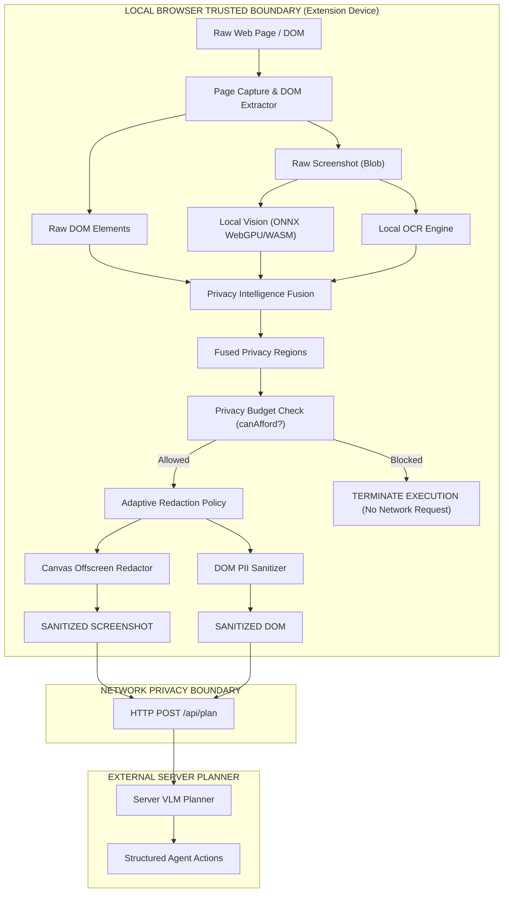

# Privacy Threat Model and Data-Flow Architecture

---

## 1. Executive Summary

This document defines the security assets, trust boundaries, threat actors, privacy invariants, and attack surfaces for the **SIH 2026 Privacy-Preserving Browser Agent**.

The core mission of the architecture is to enforce a **strict on-device client privacy boundary**: raw screenshots, raw DOM values, raw OCR text, and sensitive PII MUST NEVER cross the network boundary to external server-side VLM planners.

---

## 2. Trust Boundaries & Data-Flow Diagram



### Text Data-Flow Representation:
```text
RAW PAGE STATE
   │
   ├─► Local DOM Extractor ─────► Raw DOM Elements ──────────┐
   └─► Tab Canvas Capture  ─────► Raw Screenshot Blob ───────┤
                                                             ▼
                                                Privacy Intelligence Fusion
                                                (DOM + Local OCR + Local Vision)
                                                             │
                                                             ▼
                                                  Privacy Budget Manager
                                                 (Cost Calculation & Check)
                                                             │
                                                   ┌─────────┴─────────┐
                                      budget >= cost │                 │ budget < cost
                                                     ▼                 ▼
                                         Adaptive Redaction     NETWORK BLOCKED
                                               Policy           (Zero Data Sent)
                                                     │
                                           ┌─────────┴─────────┐
                                           ▼                   ▼
                                    Canvas Redactor      DOM Sanitizer
                                           │                   │
                                           ▼                   ▼
                                      SANITIZED            SANITIZED
                                      SCREENSHOT              DOM
                                           │                   │
                                           └─────────┬─────────┘
                                                     ▼
                                           NETWORK BOUNDARY
                                           (HTTP POST /api/plan)
```

---

## 3. Security Assets

1. **Raw Page Visuals**: Unredacted browser screenshots containing rendered passwords, financial data, emails, addresses, and identity photos.
2. **Raw DOM Structure**: Complete HTML inputs, text values, form labels, and attribute hints.
3. **Raw OCR Text**: Text segments extracted from image/canvas elements by the local OCR worker.
4. **Sensitive PII Values**:
   - `PASSWORD` (Credentials & auth tokens)
   - `CREDIT_CARD` (PCI-DSS financial data)
   - `SSN` (National identification numbers)
   - `EMAIL` (Personal contact addresses)
   - `PHONE` (Phone numbers)
5. **Biometric Visual Regions**: Identifiable faces and personal avatar photos.
6. **Privacy Budget Accounting State**: Client-side budget consumption counters and risk scores.

---

## 4. Threat Actors & Attack Vectors

| Threat Actor | Description | Attack Vector / Risk | Mitigation |
|--------------|-------------|----------------------|------------|
| **Malicious Web Page** | Adversarial site attempting to steal PII or prompt-inject VLM | Phishing inputs, hidden canvas PII, malicious text injection | Local PII detection, visual redaction, DOM sanitization, action target validation |
| **Untrusted / Compromised Server** | External VLM server or third-party provider API | Passive eavesdropping, data harvesting, server logging of request bodies | Network boundary sanitization: Server receives zero raw PII or unredacted visuals |
| **Network Eavesdropper (MITM)** | Interceptor listening on transit payload | Man-in-the-middle sniffing of HTTP request payloads | Payload contains only redacted screenshots and sanitized DOM labels |
| **Accidental Logging** | Extension developer console statements | Unsafe `console.log()` serializing raw PII or screenshots | Privacy-safe logger auditing; metadata-only console outputs |
| **Budget Bypass Attempt** | Malicious task attempting repeated costly transmission | Depleting privacy budget to force raw transmission | Pre-network hard gatekeeper halting loop before `fetchAgentPlan()` |

---

## 5. Non-Negotiable Privacy Invariants

1. **Zero Raw Screenshot Leakage**: Raw screenshot Blobs and unredacted Base64 image strings MUST NEVER be assigned to network payloads or transmitted externally.
2. **Zero Raw DOM PII Leakage**: Password values, hidden field contents, emails, and sensitive input labels MUST be replaced with `[REDACTED_*]` tokens before network POST.
3. **Zero Raw OCR Text Transmission**: Extracted OCR text strings stay local to the privacy intelligence fusion module; they are NEVER included in server request bodies.
4. **Pre-Network Privacy Budget Enforcement**: If `canAfford(stepCost)` returns `false`, execution terminates immediately. Zero HTTP requests are dispatched.
5. **Monotonic High-Risk Redaction**: High-risk PII (`PASSWORD`, `CREDIT_CARD`, `SSN`, `EMAIL`, `PHONE`) MUST ALWAYS evaluate to `BLACK`. No adaptive budget degradation can ever downgrade high-risk PII to `BLUR` or `PRESERVE`.
6. **No Raw PII in Telemetry / Audit Exports**: `session-audit.json`, popup state, and console logs store aggregate counts, durations, and category names ONLY.

---

## 6. Manifest V3 Permission Audit

| Permission | Purpose | Principle of Least Privilege Verification |
|------------|---------|------------------------------------------|
| `activeTab` | Tab screenshot capture & DOM execution | Granted only when user interacts with extension popup |
| `scripting` | Injection of `injectedActionExecutor` callback | Required to trigger browser actions (`click`, `type`, `scroll`) |
| `storage` | Persistence of local popup preferences | Local device storage only |
| `sidePanel` | Display of extension audit dashboard UI | Extension UI frame |
| `<all_urls>` | Host permission for content script injection | Necessary for DOM extraction across target websites |

---

## 7. Residual Risks

- **Untracked Low-Contrast Text**: Extremely low-contrast or noisy visual text not captured by local OCR or DOM regex could escape visual redaction if not detected by Vision.
- **Unclassified Custom Form Controls**: Non-standard `div`-based custom inputs that do not use standard tags or attributes might require manual labeling.
